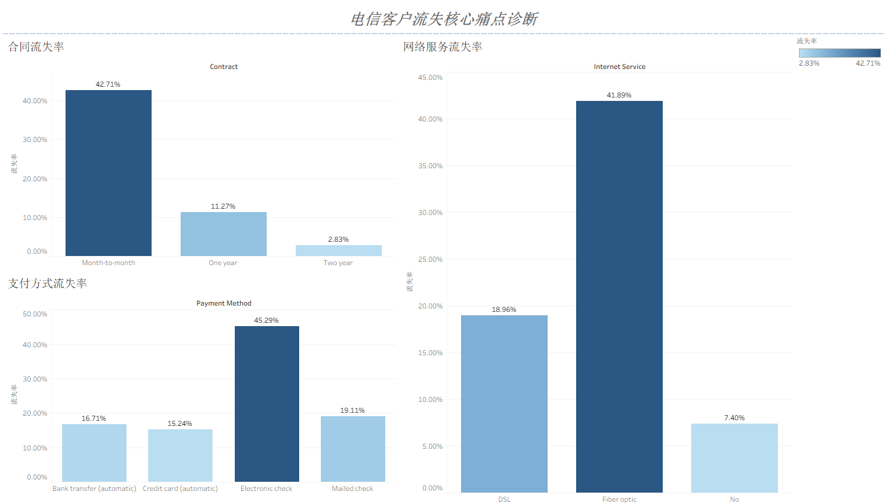
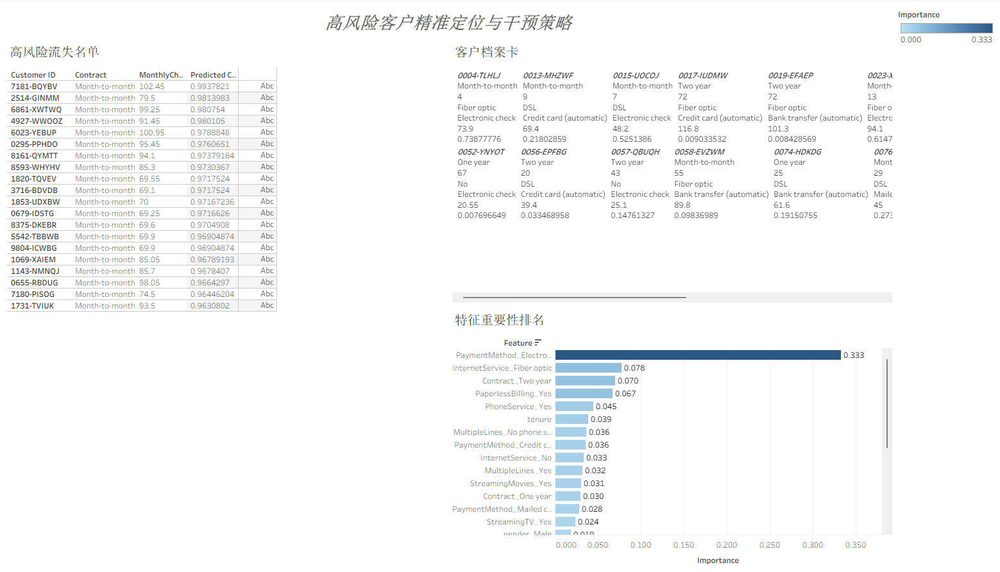

# Telecom Customer Churn Prediction

**Author:** [Your Name]
**Date:** 2025-07-31

---

## 1. Project Overview

This project is an end-to-end data science endeavor focused on predicting customer churn for a telecommunications company. The primary goal is to identify key drivers of churn and build a robust machine learning model to proactively identify at-risk customers. This allows the business to implement targeted retention strategies, reducing revenue loss and improving customer satisfaction.

The project encompasses the entire data science lifecycle:
- **Data Cleaning & Preprocessing:** Handling missing values and preparing data for analysis.
- **Exploratory Data Analysis (EDA):** Uncovering insights and patterns through visualization.
- **Feature Engineering:** Creating new features to improve model performance.
- **Machine Learning Modeling:** Building and evaluating a high-performance XGBoost classifier.
- **Model Interpretation:** Understanding the "why" behind the model's predictions.
- **Interactive Dashboarding:** Creating a decision-making tool with Tableau.

---

## 2. Key Findings & EDA

Through exploratory data analysis, we identified three primary drivers of customer churn. The interactive dashboard below highlights these core pain points.

### **Dashboard Snapshot: The Three Core Drivers of Churn**



- **Short-term Contracts:** Customers on a month-to-month contract exhibit a significantly higher churn rate (42.7%) compared to those on long-term contracts.
- **Fiber Optic Service:** While a premium service, customers with Fiber Optic internet have a surprisingly high churn rate (41.9%), suggesting potential issues with pricing, service quality, or competition.
- **Electronic Check Payments:** This manual payment method is associated with the highest churn rate (45.3%), likely because it prompts a monthly re-evaluation of the service's value.

---

## 3. Predictive Modeling

To proactively identify at-risk customers, we developed a machine learning model.

- **Algorithm:** We chose the **XGBoost Classifier** due to its high performance and efficiency.
- **Handling Class Imbalance:** The dataset was highly imbalanced (only 27% churn). We addressed this using the **SMOTE (Synthetic Minority Over-sampling Technique)**, which significantly improved the model's ability to detect the minority churn class.
- **Performance:** The final model achieved an **AUC score of 0.82** on the test set, demonstrating strong predictive power.

---

## 4. Interactive Decision-Making Dashboard

To translate model insights into actionable business intelligence, a second interactive dashboard was created in Tableau. This "Decision-Making Cockpit" allows business users to identify and understand high-risk customers.

### **Dashboard Snapshot: High-Risk Customer Cockpit**



- **High-Risk Customer List:** The dashboard provides a real-time, sorted list of customers with the highest predicted churn probability.
- **Individual Customer Profile:** By clicking on any customer, users can instantly view their detailed profile, including contract type, monthly charges, and tenure.
- **Actionable Insights:** This tool empowers the retention team to move from generic campaigns to highly targeted, data-driven interventions.

---

## 5. Tools & Technologies

- **Programming Language:** Python
- **Libraries:** Pandas, Scikit-learn, XGBoost, imblearn, Matplotlib, Seaborn
- **BI Tool:** Tableau
- **Version Control:** Git & GitHub

---

## 6. Repository Structure

```
.
├── data/
│   ├── Telco_Churn_EDA_Data.csv
│   ├── Telco_Churn_Results_Data.csv
│   └── Telco_Churn_Feature_Importance.csv
├── images/
│   ├── dashboard_diagnosis.png
│   └── dashboard_prediction.png
├── models/
│   └── telecom_churn_model.joblib
├── notebooks/
│   ├── save_model.py
│   ├── fix_data.py
│   └── 电信业务引导.md
├── .gitignore
├── LICENSE
├── README.md
└── Telecom_Churn_Story.twbx
```
